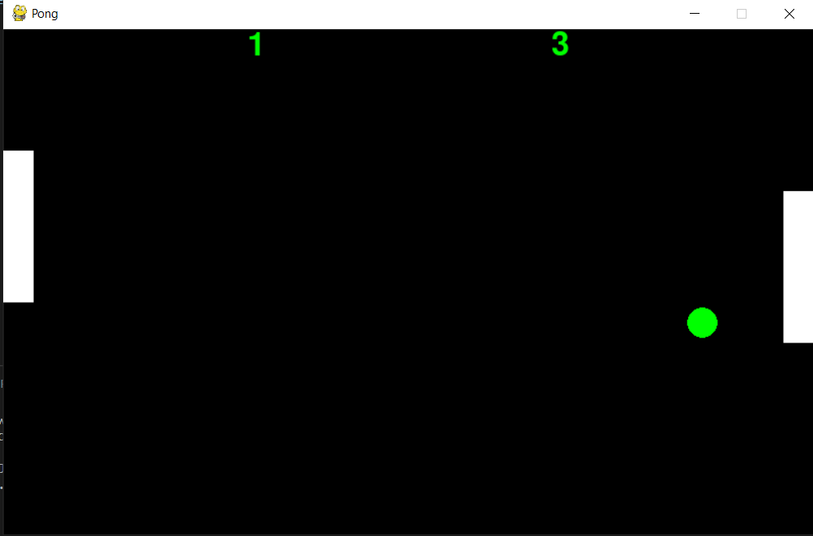

# pong_game_eng
Made by Jeremy Marks and Keaton Myers

### Game Image

### Versions
- Os Version: Windows 10 Version 21H2 (OS Build 19044.2604)
- Python Version: python 3.9.1
- Pygame Version: 2.1.2

### Motivation

We decided to stick with pong as it provided a simple game to practice with movement controls and collision. The fact that the actual mechanics are so simple makes the process of understanding the effects different changes have. For example fine tuning the speed of the ball and the paddles to make sure the player feels in control. It also is perfect for demonstrating a MVC design structure since several of the parts are reusable.

### Structual Reasoning

We followed closely with the MVC structure. The program starts in a main which initiates the controller and then starts the game loop. Inside the game loop we monitor for any button presses that need to be handled as well as any changes that need to be made on a frame by frame basis. These are detected by the controller but the actual updating of the objects, in this case the ball and paddles is handled by the classes in the model file. Finally once any changes to the object locations were made we use the view to update the drawing of the screen to represent the new location for the 3 objects. One interesting thing we did was make a from scratch object to work for the ball instead of operating off of the py games integrated rect object. This let us practice with implementing positional and collision tracking, and element display without any existing infrastructure.

### Future Work

Depending on how the game needs to be expanded it could be fairly easy with how we have it set up. The code is fairly generic and could support other forms of movement such as acceleration based. One route we considered was changing velocity based on the distance from the center from the paddle the ball impacted. Another option to make the controls feel a little smoother is add a period of acceleration to the paddles before they reach their max velocity.

#### Generalization

The structure we have in place could fairly easily be applied to other projects. When creating the classes for the entities despite the fact that some were limited to the y plane we included the option to modify their x plane as well. Another thing we did was incorporate the ability to modify position with both acceleration and velocity so that either could be used and work on the objects depending on the programmers needs. What we could do but didn't that could help would be create a generalized function to assess the collision of two objects so that could be done more efficiently on projects with larger lists of objects.

